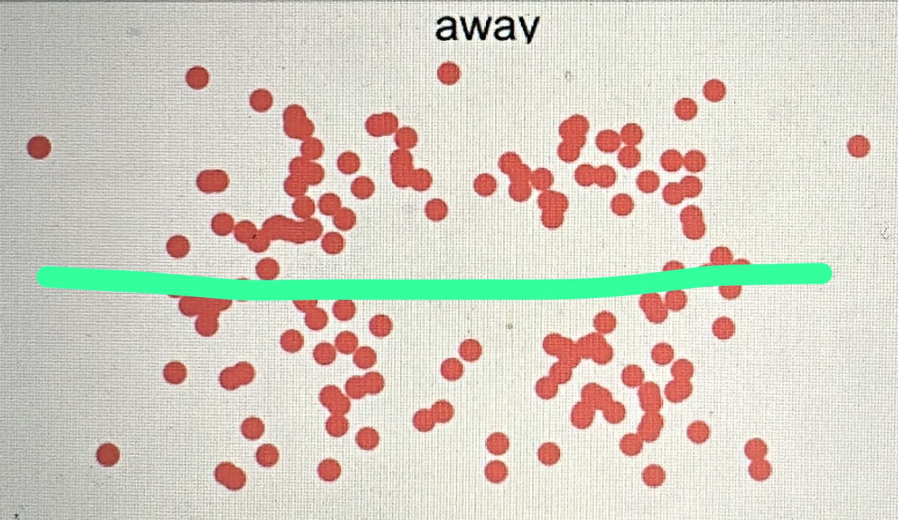

```{r setup, include=FALSE}
knitr::opts_chunk$set(echo = TRUE)
```

## Exportamos las librerias
A continuación, se cargan las librerías necesarias para el desarrollo de esta práctica:

* **tidyverse:** Colección de paquetes útiles para manipulación y visualización de datos.

* **datasauRus:** Contiene el conjunto de datos datasaurus_dozen, utilizado en esta práctica.

* **dplyr:** Proporciona funciones eficientes para la manipulación de datos.

* **ggplot2:** Permite generar gráficos personalizados y de alta calidad.

```{r}
  library(tidyverse)
  library(datasauRus)
  library(dplyr)
  library(ggplot2)
  

```

## Resumen del dataset
En esta sección se presentan estadísticas descriptivas del conjunto de datos datasaurus_dozen, calculadas para cada subgrupo. A pesar de que las métricas estadísticas como la media, desviación estándar y correlación son muy similares entre los grupos, como se evidenciará posteriormente, sus representaciones gráficas son completamente distintas.
Esta observación refuerza el mensaje del Cuarteto de Anscombe moderno: las estadísticas resumen, pero no sustituyen a la visualización.

Para este análisis, se emplean las funciones `group_by()` y `summarize()`.

```{r}
datasaurus_dozen %>%
  group_by(dataset) %>%
  summarize(
    mean_x = mean(x),
    mean_y = mean(y),
    std_dev_x = sd(x),
    std_dev_y = sd(y),
    corr_x_y = cor(x,y)
  )

```


## Visualización de todos los subconjuntos

A continuación, se presentan 13 gráficos correspondientes a cada subgrupo del conjunto de datos. Aunque todos ellos comparten estadísticas similares, la visualización revela formas completamente diferentes, lo que destaca la importancia de los gráficos en el análisis de datos.

```{r}

ggplot(datasaurus_dozen, aes(x=x, y=y, colour = dataset))+
  geom_point()+
  theme_void()+
  theme(legend.position = "none")+
  facet_wrap(~dataset, ncol = 3)

```


## Análisis estadístico del subconjunto "away"

En esta sección se analiza exclusivamente el subconjunto "away". Se calculan estadísticas descriptivas como la media, desviación estándar y correlación. Al igual que otros subconjuntos, presenta estadísticas similares, pero su representación gráfica revela una forma distinta.

```{r}
datasaurus_dozen %>%
  filter(dataset == "away") %>%
  summarize(
    mean_x = mean(x),
    mean_y = mean(y),
    std_dev_x = sd(x),
    std_dev_y = sd(y),
    corr_x_y = cor(x, y)
  )
```


## Visualización del subconjunto "away"

Aquí se grafica el subconjunto "away", el cual presenta una forma elíptica. Este patrón no puede deducirse únicamente a partir de estadísticas numéricas, lo que refuerza la necesidad de complementar el análisis con visualizaciones.

```{r}
ggplot(filter(datasaurus_dozen, dataset == "away"), aes(x = x, y = y)) +
  geom_point(color = "red") +
  theme_minimal() +
  labs(title = "Dataset: Away")
```

## Regresión lineal sobre el subconjunto "away"

Se ajusta un modelo de regresión lineal simple sobre los datos del subconjunto "away", utilizando la función lm(). La gráfica resultante muestra los puntos junto con la recta de regresión superpuesta en color rojo. Esto permite contrastar la línea ajustada estadísticamente con la percepción visual de los datos.

```{r}
# Filtramos el dataset
away_data <- datasaurus_dozen %>%
  filter(dataset == "away")

# Ajustamos el modelo de regresión lineal
modelo <- lm(y ~ x, data = away_data)

ggplot(away_data, aes(x = x, y = y)) +
  geom_point(color = "red") +
  geom_smooth(method = "lm", se = FALSE, color = "green", linewidth = 1) +
  theme_minimal() +
  labs(title = "Regresión lineal - Dataset: Away")
```

## Comparación con regresión manual

A continuación se incluye una imagen con una regresión trazada manualmente sobre el subconjunto "away", basada únicamente en la distribución visual de los puntos, sin utilizar ningún cálculo estadístico. Esta comparación ayuda a evaluar la precisión de nuestra intuición frente al modelo estadístico.

```{r}

```

## Conclusiones

Esta práctica demuestra que, aunque distintos conjuntos de datos pueden tener estadísticas similares, sus distribuciones visuales pueden ser completamente distintas. Por ello, es fundamental complementar el análisis numérico con visualizaciones gráficas que permitan captar la verdadera estructura de los datos.
