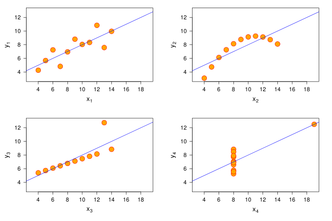

  

<h1 align="center">Cuarteto de Anscombe y Regresión Lineal</h1>

  <strong>Universidad Politécnica Salesiana</strong> 
  Carrera de Ingeniería en Ciencias de la Computación 
  Periodo Mayo - Septiembre 2025 
  Estudiante: José Miguel Villalta Heredia

---

## Introducción Teórica al Cuarteto de Anscombe

El *Cuarteto de Anscombe* es un conjunto de **cuatro grupos de datos numéricos** creados por el estadístico británico **Francis J. Anscombe** en 1973, con el objetivo de ilustrar la importancia de **visualizar los datos antes de realizar análisis estadísticos**.

A pesar de que estos cuatro conjuntos comparten características estadísticas idénticas —como la media y la desviación estándar de `x` e `y`, el coeficiente de correlación, y la regresión lineal— sus **distribuciones gráficas son completamente diferentes**. Esta disparidad pone en evidencia cómo el uso exclusivo de estadísticos resumen puede ser insuficiente o incluso engañoso.

### Objetivos del Cuarteto
- Resaltar la necesidad de inspección visual en los análisis de datos.
- Demostrar que conjuntos de datos con estadísticas idénticas pueden tener estructuras muy distintas.
- Promover buenas prácticas de visualización y análisis exploratorio.

### Visualización del Cuarteto de Anscombe

---

### Referencia Académica

Anscombe, F. J. (1973). *Graphs in Statistical Analysis*. The American Statistician, **27**(1), 17–21. https://doi.org/10.1080/00031305.1973.10478966

---

### Estructura del proyecto
#### `data`
En este directorio se encuentran los datasets utilizados en la práctica:
- `df_anscombe.csv`
- `datasaurus.csv`

#### `R`
Esta carpeta contiene los archivos realizados en clase y la vista del mismo:
- `Datasaurus 2025.Rmd`
- `Datasaurus-2025.html`
